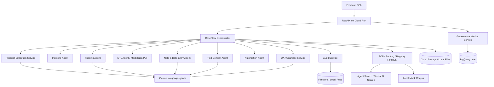

# CaseFlow Agent — Combined Codex Handoff Master v3

This file combines all v3 handoff documents, including six-agent visibility requirements, in one place for Codex ingestion.


---

# 00_README_Codex_Handoff_Package_v3.md

# CaseFlow Agent — Codex Handoff Package v2

## Purpose

This package updates the CaseFlow Agent handoff after new meeting notes, two LERS templates, and the leadership requirement that the six RFP agents must be visibly demonstrated in the UI:

1. Meeting notes from the LIS prototype check-in.
2. `LERS Request Template.docx`
3. `Template LERS Response.docx`

The major update is that CaseFlow should no longer be framed only as **email triage in the Cases Platform**.

It should now be framed as:

> **LERS request intake → extraction → triage → route / escalation → mock data retrieval → response package drafting → human review → governance insights.**

This is still a human-led workflow. The prototype must not imply autonomous legal decision-making, autonomous disclosure, autonomous production, or autonomous email sending.

## What changed from v1

| Area | v1 direction | v2 direction |
|---|---|---|
| Core workflow | Case pool email triage | LERS request package intake and response package preparation |
| Main artifact | PDF page 50 workflow | PDF page 50 + LERS Request Template + Template LERS Response |
| Data model | Case intake and email objects | Legal request, legal process, identifiers, requested data categories, production package |
| Output | Notes and email draft | Response package draft, deficiency response draft, notes, audit trail |
| Governance | Queue health, SLA, audit | Product/domain volume, processing time by product, bottlenecks, response status, agent acceptance, audit |
| Demo scenarios | Triage scenarios | 6 synthetic legal request scenarios |
| Agent visibility | Six agents mapped to case triage | Six agents visibly mapped to request intake and response package preparation |

## Files in this package

| File | Purpose |
|---|---|
| `01_Product_Brief_and_Source_of_Truth_v2.md` | Updated product definition and source hierarchy. |
| `02_LERS_Request_and_Response_Template_Analysis.md` | What the two LERS templates add to the product scope. |
| `03_Synthetic_Data_and_Demo_Scenarios.md` | Synthetic demo scenarios and example payload strategy. |
| `04_Target_GCP_Architecture_v2.md` | Updated GCP/Gemini architecture for request intake and response package drafting. |
| `05_Codex_Workplan_v2.md` | Updated staged workplan for Codex. |
| `06_Backend_Foundation_Scaffold_Spec_v2.md` | Updated backend scaffold spec. |
| `07_Data_Model_and_API_Contracts_v2.md` | Updated core models and API routes. |
| `08_Agent_Contracts_and_Behavior_v2.md` | Updated six-agent contracts mapped to LERS request processing. |
| `09_Gemini_Retrieval_and_Response_Drafting_v2.md` | Gemini, prompt, retrieval, response package drafting, and validation plan. |
| `10_Governance_Insights_and_Audit_Spec_v2.md` | Updated governance layer with product/domain KPIs and audit readiness. |
| `11_UI_Workflow_and_Screen_Requirements_v2.md` | Updated UI screens and flow. |
| `12_Testing_Evaluation_and_Golden_Scenarios_v2.md` | Updated golden scenarios and evaluation plan. |
| `13_Definition_of_Done_v2.md` | Updated definition of done. |
| `14_First_PR_Scope_v2.md` | Updated first PR scope. |
| `15_Story_Capture_Reuse_Analysis_Instructions_v2.md` | Reuse-analysis instructions updated with v2 direction. |
| `00_Combined_Codex_Handoff_Master_v2.md` | Combined single-file package for Codex ingestion. |


## Six-Agent Visibility Requirement

Leadership has made this a hard requirement: the prototype must visibly demonstrate the six RFP agents, not merely implement them as hidden backend modules.

The prototype is not complete unless all six RFP agents are visibly represented in the UI, each acts on request data, each produces a structured output, and each writes an inspectable audit event.

| RFP Agent | Required visible demo action | UI proof |
|---|---|---|
| **Indexing Agent** | Indexes the request by legal process, product/domain, identifiers, SOP matches, and priority | Agent workflow step card showing labels, priority rank, SOP/evidence matches |
| **Triaging Agent** | Classifies request type, urgency, sensitivity, queue, and SME review need | Agent workflow step card showing classification, confidence, route, and rationale |
| **ETL Agent** | Simulates approved responsive data pull from mock repository | Agent workflow step card showing mock query, returned record count, data confidence |
| **Note Taking and Data Entry Agent** | Drafts structured internal notes and fields | Agent workflow step card showing note draft, fields to update, missing fields |
| **Text Content Agent** | Drafts response package, deficiency response, SME notification, or production summary | Agent workflow step card showing drafted sections and approval state |
| **Automation Agent** | Prepares route, escalation, assignment, QA sampling, or follow-up action | Agent workflow step card showing prepared action, target owner/queue, approval status |

The six agents should be shown as named workflow actors in the product experience. Do not collapse them into a generic “AI workflow service,” “assistant,” or “orchestrator” label.


## Core guardrails

- No Law Enforcement disclosure steps are automated.
- No autonomous production package release.
- No autonomous email sending.
- No production Cases / LERS write-back in MVP.
- No legal determination should be made by the agent.
- Human approval is required for route, note, response package, deficiency response, and any simulated production state.
- Sensitive, urgent, non-disclosure, pen register / trap-and-trace, sealed, low-confidence, ambiguous, missing-field, and overbroad requests require human review.
- Every agent and human action must create an audit event.
- Local development must run without live GCP credentials.
- GCP integrations must be adapter-based and swappable.

## Recommended immediate build path

1. Update mock data and data model around legal request packages.
2. Build deterministic request extraction, classification, validation, response package draft, and audit flow.
3. Add all six agents as visible workflow steps.
4. Add governance metrics around product/domain volume, processing time, bottlenecks, response package status, human overrides, and audit readiness.
5. Add Gemini after deterministic workflow is stable.


---

# 01_Product_Brief_and_Source_of_Truth_v3.md

# CaseFlow Agent — Product Brief and Source of Truth v2

## Product statement

**CaseFlow Agent** is a GCP-native, human-led agentic workflow for Google Legal Investigations Support / LERS-style request processing.

It assists legal operations analysts with:

- LERS request package intake
- request document parsing
- legal process extraction
- subject identifier extraction
- requested data category extraction
- product / data-domain classification
- urgency and sensitivity classification
- special-handling detection
- missing-field / deficiency detection
- route and escalation recommendations
- mock data pull / ETL simulation
- response package drafting
- deficiency response drafting
- backend note drafting
- analyst review and approval
- audit logging
- governance insights

It is **not** a chatbot and it is **not** autonomous legal processing.

## Updated source-of-truth hierarchy

| Priority | Source | How Codex should use it |
|---:|---|---|
| 1 | Meeting notes | Establish prototype priorities: governance/insights, synthetic data, all six agents visible, triage + response, AHT/CCI alignment. |
| 2 | LERS Request Template | Defines request intake fields, request complexity, legal process flags, product/data categories, identifiers, special handling. |
| 3 | Template LERS Response | Defines response package output contract: request ID, production ID, agency, identifiers, production summary, records, definitions, chain of custody, certification. |
| 4 | PDF page 50 | Existing core workflow: email triage in Cases Platform; still useful as intake/routing/audit guardrail. |
| 5 | PDF page 48 | Six illustrative agents that must be visibly represented. |
| 6 | PDF page 47 | Agentic architecture guardrails: GCP-native, no Core Eng changes, risk controls, escalation logic, UAT, no LE disclosure automation. |
| 7 | PDF pages 36–43 and 53–54 | Governance/analytics requirements: queue health, SLA, bottlenecks, AHT, TAT, data confidence. |
| 8 | Story Capture backend reuse analysis | Implementation pattern reference only. |
| 9 | UI mockups/design direction | Frontend visual direction only. |

## Updated product thesis

The prototype should show a controlled workflow where CaseFlow Agent can ingest a real-style legal request package, extract operationally relevant fields, classify and prioritize the request, prepare routing/escalation, simulate approved data retrieval, draft a response package, and preserve a complete audit trail for human review.

## Updated MVP narrative

> “CaseFlow Agent helps legal operations teams turn complex LERS requests into structured, reviewable work. It extracts the request, classifies the legal process and product/data domain, identifies risk flags and missing information, recommends routing, simulates approved data retrieval, drafts a response package, and gives leaders a governance view of volume, processing time, bottlenecks, exceptions, and audit readiness.”


## Six-Agent Visibility Requirement

Leadership has made this a hard requirement: the prototype must visibly demonstrate the six RFP agents, not merely implement them as hidden backend modules.

The prototype is not complete unless all six RFP agents are visibly represented in the UI, each acts on request data, each produces a structured output, and each writes an inspectable audit event.

| RFP Agent | Required visible demo action | UI proof |
|---|---|---|
| **Indexing Agent** | Indexes the request by legal process, product/domain, identifiers, SOP matches, and priority | Agent workflow step card showing labels, priority rank, SOP/evidence matches |
| **Triaging Agent** | Classifies request type, urgency, sensitivity, queue, and SME review need | Agent workflow step card showing classification, confidence, route, and rationale |
| **ETL Agent** | Simulates approved responsive data pull from mock repository | Agent workflow step card showing mock query, returned record count, data confidence |
| **Note Taking and Data Entry Agent** | Drafts structured internal notes and fields | Agent workflow step card showing note draft, fields to update, missing fields |
| **Text Content Agent** | Drafts response package, deficiency response, SME notification, or production summary | Agent workflow step card showing drafted sections and approval state |
| **Automation Agent** | Prepares route, escalation, assignment, QA sampling, or follow-up action | Agent workflow step card showing prepared action, target owner/queue, approval status |

The six agents should be shown as named workflow actors in the product experience. Do not collapse them into a generic “AI workflow service,” “assistant,” or “orchestrator” label.


## Non-negotiable product guardrails

- The agent does not decide whether production is legally valid.
- The agent does not release records.
- The agent does not send the final response.
- The agent does not automate LE disclosure steps.
- The agent does not make legal determinations.
- The agent does not write to production Google systems in MVP.
- Every route, note, draft, response package, or escalation remains human-reviewed.
- All sensitive handling flags require analyst / SME review.
- Auditability is a first-class product feature.

## Primary users

| User | Needs |
|---|---|
| Analyst | Review extracted request fields, classification, route recommendation, note draft, response package draft, and approve/escalate. |
| SME | Review sensitive, complex, missing-field, sealed, non-disclosure, pen register / trap-and-trace, or low-confidence cases. |
| QA / Governance reviewer | Inspect agent decisions, human overrides, missing review steps, and audit trail completeness. |
| Operations lead | Monitor volume by product, SLA risk, processing time, backlog, response package status, escalations, and agent usefulness. |
| Google stakeholder | Understand whether the workflow is controlled, compliant, auditable, and economically relevant. |

## Updated MVP scope

The MVP should demonstrate:

0. all six RFP agents visibly acting on data in a named workflow rail
1. request intake queue
2. request detail page showing source request and extracted fields
3. all six agents visibly represented
4. legal process and product/domain classification
5. special-handling and risk flag detection
6. missing-field / deficiency detection
7. route / escalation recommendation
8. mock ETL / responsive record simulation
9. response package draft based on the Template LERS Response
10. deficiency response draft for bad requests
11. analyst review / approval
12. audit timeline
13. governance dashboard

## Out of scope for MVP

- production LERS integration
- production Cases write-back
- production data pull from Google systems
- production email send
- actual disclosure automation
- legal sufficiency determination
- external law enforcement portal access
- real requester data
- real PII
- cross-silo production deployment

## Key open questions

1. Which request types are highest volume?
2. Which product/domain segmentation matters most: Gmail, Android, YouTube, Maps/Location, Voice, Drive, Photos, Pay, etc.?
3. What are the actual queue names and routing rules?
4. What makes a request deficient?
5. Which request types always require SME review?
6. What AHT reduction assumptions should the demo align to?
7. Should response drafting show “draft package only” or “approved production package” with synthetic records?

## Required Six-Agent Demo Coverage

The MVP must include one primary scenario where all six agents run in sequence against the same legal request.

Recommended primary scenario: **Scenario A — GPS location happy path**.

| Agent | Required output in Scenario A |
|---|---|
| Indexing Agent | Request labels: search warrant, GPS/location, Maps/Location, account/device identifiers |
| Triaging Agent | Product/domain, urgency, route recommendation, review need |
| ETL Agent | Mock responsive records and data confidence |
| Note Taking and Data Entry Agent | Internal note draft and fields to update |
| Text Content Agent | Response package draft sections |
| Automation Agent | Prepared route/assignment/approval action |

Secondary scenarios may skip ETL when no data pull is appropriate, but the total demo set must show each of the six agents at least once.


---

# 02_LERS_Request_and_Response_Template_Analysis.md

# LERS Request and Response Template Analysis

## Purpose

The two new templates materially change the build plan because they provide:

1. a realistic **input document shape** for legal request ingestion
2. a realistic **output document shape** for response package drafting

The request template should be treated as synthetic/example material, not legal advice or a final production SOP.

## LERS Request Template — what it adds

The request template is a search warrant / ex parte court order format for Google data. It includes instruction text, placeholder text, legal authority references, requested data categories, identifiers, special handling, and court order language.

### Important intake fields

| Field group | Examples to extract |
|---|---|
| Court / jurisdiction | County of Larimer, State of Colorado, Combined Court |
| Legal process type | Search warrant, ex parte court order, pen register, trap and trace, location information order |
| Recipient | Google LLC, Google Legal Investigations Support, LERS |
| Affiant / officer | name, title, agency, badge number, contact information |
| Requesting agency | agency name, address, phone, email |
| Subject account | Gmail account, Google ID / UID |
| Device identifiers | ESN, IMEI, MEID, MAC ID |
| Date range | “Between the dates of DATE OF INTEREST through DATE OF INTEREST” |
| Offense | listed criminal offenses |
| Legal authority | 18 U.S.C. §2703, 18 U.S.C. §§3122 and 3123, C.R.S. §16-3-301, §16-3-301.1, §16-3-303.5, Crim. P. 41 |
| Production deadline | records produced within 35 days of service |
| Service deadline | order must be served within 14 days after issuance |
| Pen register period | 60 days or until investigation is complete |
| Ongoing access cadence | daily / once every 15 minutes in the template language |
| Non-disclosure period | one year unless otherwise ordered |
| Special handling | seal order, no adverse action, no subscriber disclosure |

## Requested data categories

The request template includes a broad list of Google data categories. CaseFlow should not automatically produce these, but it should detect and classify them.

| Category | Examples |
|---|---|
| Subscriber info | name, DOB, gender, contact email, address, phone, personal identifiers |
| Account creation and login | account creation date, length of service, registration IP, Port IDs |
| Associated accounts | other Gmail addresses, accounts linked by device or cookie |
| Device identifiers | ESN, ICCID, IMSI, IMEI, MAC, activation dates |
| Google Cloud / Google One | data collected in connection with associated devices |
| Chromebook | data collected from associated Chromebook devices |
| Activity data | web and app activity, voice/audio activity, YouTube search/watch/comment/stories |
| Location data | GPS, cell site/cell tower, Wi-Fi, SensorVault, coordinates, timeline |
| Semantic Location History | activity, start/end location, duration, distance, waypoints, places visited, location confidence |
| Email contents | sent/received/deleted/stored/preserved/draft emails and attachments |
| Photos/videos | stored/captured media and metadata |
| Services used | Maps, Duo, Hangouts, Chrome, Home, Drive, Nest, Play, Photos, Voice, YouTube |
| Google Voice | call detail records, SMS/MMS, voicemail |
| Calendar | calendars, entries, notes, alerts, invites |
| Contacts | names, phone numbers, emails, social links, images |
| Docs/Sheets/Slides | files created/shared/downloaded |
| Support communications | records of communications between Google and any person regarding the account |
| Decryption info | keys or info necessary to decrypt produced data, when available |
| Privacy/security | privacy settings, verification methods, 2FA phone |
| Payments | payment methods, purchase history, subscriptions |
| Tombstone archive | deleted account data archive |

## Special handling flags to detect

These should become first-class fields in the data model.

```json
{
  "sealed": true,
  "non_disclosure_to_subscriber": true,
  "no_adverse_action": true,
  "pen_register_requested": true,
  "trap_and_trace_requested": true,
  "ongoing_access_requested": true,
  "location_tracking_requested": true,
  "content_requested": true,
  "tombstone_requested": true,
  "production_deadline_days": 35,
  "service_deadline_days": 14,
  "nondisclosure_period": "one_year"
}
```

## Template LERS Response — what it adds

The response template gives the expected output contract for a production package.

### Output sections

| Section | Fields |
|---|---|
| Header | Request ID, Production ID, Date Produced |
| Requesting agency | Agency, Case Number, Officer, Legal Process, Date Received |
| Subject identifiers | Account ID, Customer Reference, Associated Device ID |
| Production summary | Start Date, End Date, Total Responsive Records, ordinary-course-of-business statement |
| Index of produced records | Record ID, Timestamp UTC, Latitude, Longitude, Accuracy, Source |
| Data field definitions | Timestamp, Latitude, Longitude, Accuracy, Source |
| Chain of custody | Collection Date, Collection Method, Collected By, Review Status |
| Production certification | Authorized Representative, title, certification language |
| End marker | End of production package |

## Response package object

```json
{
  "request_id": "LER-2026-004812",
  "production_id": "PROD-2026-004812-01",
  "date_produced": "2026-06-09",
  "requesting_agency": {
    "agency": "Los Angeles County Sheriff's Office",
    "case_number": "MC-26-11784",
    "officer": "Detective Sarah Johnson",
    "legal_process": "Search Warrant John Doe",
    "date_received": "2026-06-01"
  },
  "subject_identifiers": {
    "account_id": "ACC-7784512",
    "customer_reference": "CUST-992181",
    "associated_device_id": "DEV-88471"
  },
  "production_summary": {
    "start_date": "2026-05-10T00:00:00Z",
    "end_date": "2026-05-15T23:59:59Z",
    "total_responsive_records": 8
  },
  "records": [],
  "chain_of_custody": {
    "collection_date": "2026-06-08",
    "collection_method": "Internal Location Data Repository Query",
    "collected_by": "Legal Response Operations Team",
    "review_status": "Reviewed and Approved"
  },
  "certification": {
    "authorized_representative": "Jane Doe",
    "title": "Legal Operations Analyst",
    "certification_text": "I certify that the attached records were retrieved..."
  }
}
```

## Product implications

1. The app needs a request extraction layer, not just email parsing.
2. The app needs a response package draft layer, not just email drafting.
3. Requested data category detection is critical.
4. Product/domain segmentation should power governance metrics.
5. Special handling flags should drive review/escalation logic.
6. Chain of custody and certification should be visible but always human-approved.
7. The demo should use synthetic data and never real PII.

## Required caution

The LERS Request Template contains placeholder and instructional text. The agent must be able to identify and ignore template instructions such as “PLEASE DELETE,” “YOUR NAME HERE,” and placeholder account/date/offense text when running extraction.


---

# 03_Synthetic_Data_and_Demo_Scenarios.md

# CaseFlow Agent — Synthetic Data and Demo Scenarios v2

## Principle

The meeting notes emphasized that the team needs credible synthetic examples quickly. The goal is clarity and storytelling, not perfect realism.

Use synthetic data only for MVP.

## Required synthetic dataset

Create a synthetic dataset with:

- legal request documents
- extracted request fields
- mock SOP/routing rules
- mock sensitive-party registry
- mock product/data-domain taxonomy
- mock responsive record repository
- mock response package outputs
- mock audit events
- mock governance metrics

## Scenario set

### Scenario A — Happy path GPS location production package

| Field | Value |
|---|---|
| Request type | Search warrant |
| Data category | GPS location records |
| Product/domain | Maps / Location |
| Identifiers | Account ID, customer reference, device ID |
| Date range | May 10–15, 2026 |
| Expected behavior | Extract → classify → route → mock ETL → draft response package → analyst approval |
| Agents shown | All six |

Purpose: demonstrates end-to-end value.

### Scenario B — Deficiency: missing date range

| Field | Value |
|---|---|
| Request type | Search warrant |
| Data category | Subscriber + location records |
| Problem | Missing or invalid date range |
| Expected behavior | Extract partial fields → flag deficiency → draft clarification response → hold for analyst |
| Agents shown | Indexing, Triaging, Note/Data, Text Content, Automation |

Purpose: demonstrates quality control and human intervention.

### Scenario C — Escalation: pen register / trap and trace with non-disclosure

| Field | Value |
|---|---|
| Request type | Ex parte order + pen register / trap and trace |
| Special handling | Non-disclosure, no adverse action, ongoing access |
| Expected behavior | High-sensitivity classification → SME escalation → block auto-response → audit reason |
| Agents shown | Indexing, Triaging, Automation, Note/Data, Governance |

Purpose: demonstrates safety and escalation.

### Scenario D — Overbroad request for all Google data

| Field | Value |
|---|---|
| Request type | Search warrant |
| Data category | Broad list across Gmail, YouTube, Drive, Photos, Voice, Pay, Tombstone |
| Problem | Overbroad / complex request scope |
| Expected behavior | Flag broad scope → classify multiple product domains → require SME review |
| Agents shown | Indexing, Triaging, QA/Guardrail, Governance |

Purpose: demonstrates complexity handling.

### Scenario E — Common case: subscriber information request

| Field | Value |
|---|---|
| Request type | Legal process request |
| Data category | Subscriber info and account creation |
| Expected behavior | Fast extraction, triage, route, note draft |
| Agents shown | Indexing, Triaging, Note/Data, Automation |

Purpose: demonstrates the 80% common case.

### Scenario F — No responsive records

| Field | Value |
|---|---|
| Request type | Search warrant |
| Data category | GPS location records |
| Mock ETL result | 0 responsive records |
| Expected behavior | Draft “no responsive records” package for analyst review |
| Agents shown | ETL, Text Content, Note/Data, Audit |

Purpose: demonstrates response package variation.

## Example synthetic request object

```json
{
  "request_id": "LER-2026-004812",
  "source_type": "lers_request_template",
  "legal_process_type": "Search Warrant",
  "requesting_agency": {
    "agency": "Los Angeles County Sheriff's Office",
    "case_number": "MC-26-11784",
    "officer": "Detective Sarah Johnson"
  },
  "date_received": "2026-06-01",
  "recipient": "Google Legal Investigations Support",
  "subject_identifiers": {
    "gmail_account": "synthetic.user@example.com",
    "google_id": "ACC-7784512",
    "device_id": "DEV-88471"
  },
  "requested_data_categories": ["GPS Location Records"],
  "product_domains": ["Maps / Location"],
  "requested_period": {
    "start": "2026-05-10T00:00:00Z",
    "end": "2026-05-15T23:59:59Z"
  },
  "special_handling": {
    "sealed": false,
    "non_disclosure_to_subscriber": false,
    "no_adverse_action": false,
    "pen_register_requested": false,
    "trap_and_trace_requested": false,
    "ongoing_access_requested": false
  }
}
```

## Example synthetic response records

```json
[
  {
    "record_id": "GPS-0001",
    "timestamp_utc": "2026-05-10T08:14:22Z",
    "latitude": 39.7421,
    "longitude": -104.9915,
    "accuracy_meters": 12,
    "source": "Mobile Device"
  },
  {
    "record_id": "GPS-0002",
    "timestamp_utc": "2026-05-10T09:47:03Z",
    "latitude": 39.7395,
    "longitude": -104.9848,
    "accuracy_meters": 15,
    "source": "Mobile Device"
  }
]
```

## Synthetic data files to create

```text
mock_data/
  legal_requests/
    scenario_a_gps_happy_path.json
    scenario_b_missing_date_range.json
    scenario_c_pen_register_nondisclosure.json
    scenario_d_overbroad_all_google_data.json
    scenario_e_subscriber_info_common.json
    scenario_f_no_responsive_records.json

  response_records/
    gps_records_scenario_a.json
    empty_records_scenario_f.json

  sop/
    request_intake_sop.json
    routing_rules.json
    deficiency_rules.json
    response_package_rules.json
    special_handling_rules.json

  registries/
    sensitive_party_registry.json
    product_domain_taxonomy.json
```

## Demo path

Use Scenario A as the primary demo. Keep Scenario C as the “safety / complexity” demo. Keep Scenario B as the quality-control demo.

# Six-Agent Demo Coverage Matrix

Every synthetic scenario should identify which of the six RFP agents participates. Scenario A must show all six.

| Scenario | Indexing | Triaging | ETL | Notes/Data Entry | Text Content | Automation | Notes |
|---|---:|---:|---:|---:|---:|---:|---|
| A — GPS location happy path | Yes | Yes | Yes | Yes | Yes | Yes | Primary end-to-end six-agent demo |
| B — Missing date range deficiency | Yes | Yes | No | Yes | Yes | Yes | ETL blocked because request is deficient |
| C — Pen register / non-disclosure escalation | Yes | Yes | No | Yes | Yes | Yes | ETL blocked; Automation prepares SME escalation |
| D — Overbroad all-Google-data request | Yes | Yes | No | Yes | Yes | Yes | Text Content drafts review/clarification package |
| E — Subscriber information common case | Yes | Yes | Optional | Yes | Yes | Yes | Demonstrates common high-volume flow |
| F — No responsive records | Yes | Yes | Yes | Yes | Yes | Yes | ETL returns zero records; Text Content drafts no-records package |

## Required agent-specific mock outputs

For each scenario, mock data should include an `agent_runs` section:

```json
{
  "agent_runs": {
    "indexing_agent": {
      "status": "complete",
      "output_summary": "Indexed as Search Warrant + GPS Location + Maps/Location",
      "audit_event_id": "audit_001"
    },
    "triaging_agent": {
      "status": "complete",
      "output_summary": "Routed to Location Response Review with 94% confidence",
      "audit_event_id": "audit_002"
    },
    "etl_agent": {
      "status": "complete",
      "output_summary": "8 mock GPS records returned",
      "audit_event_id": "audit_003"
    },
    "note_taking_data_entry_agent": {
      "status": "complete",
      "output_summary": "Internal response-prep note drafted",
      "audit_event_id": "audit_004"
    },
    "text_content_agent": {
      "status": "complete",
      "output_summary": "Response package draft generated",
      "audit_event_id": "audit_005"
    },
    "automation_agent": {
      "status": "complete",
      "output_summary": "Prepared analyst approval task",
      "audit_event_id": "audit_006"
    }
  }
}
```


---

# 04_Target_GCP_Architecture_v3.md

# CaseFlow Agent — Target GCP Architecture v2

## Architecture principle

Build CaseFlow as a **GCP-native sidecar workflow system** that can ingest legal request packages, run extraction/classification/drafting workflows, preserve auditability, and avoid Core Eng codebase changes.

The MVP must run locally without live GCP credentials. GCP services should be integrated behind adapter interfaces.

## Updated MVP architecture



## Service map

| Concern | MVP service / pattern | Later GCP service |
|---|---|---|
| Backend | FastAPI | Cloud Run |
| Frontend | React or Angular SPA | Cloud Run bundled or separate hosting |
| Auth | local mock user | IAP / Workspace identity |
| LLM | mock model first | Gemini via `google-genai` |
| Retrieval | local JSON/markdown | Agent Search / Vertex AI Search |
| Source docs | local file storage | Cloud Storage |
| Workflow state | local repository | Firestore |
| Audit events | local repository | Firestore + Cloud Logging |
| Governance metrics | local aggregation | Firestore + BigQuery |
| Secrets | `.env.local` ignored | Secret Manager |
| Observability | structured logs | Cloud Logging / Trace / Monitoring |
| Deployment | local dev | Cloud Run + Cloud Build |

## Local-first adapters

```text
CaseRepository:
  - LocalJsonCaseRepository
  - FirestoreCaseRepository

AuditRepository:
  - LocalJsonAuditRepository
  - FirestoreAuditRepository

StorageRepository:
  - LocalFileStorageRepository
  - CloudStorageRepository

RetrievalService:
  - LocalSopRetrievalService
  - AgentSearchRetrievalService

ModelClient:
  - MockModelClient
  - GeminiModelClient

ResponseRecordRepository:
  - LocalMockResponseRecordRepository
  - ApprovedDataSourceAdapter (future only)
```

## Model router

Do not hardcode models inside agents.

Tasks:

- `request_extraction`
- `triage_classification`
- `note_drafting`
- `response_package_drafting`
- `deficiency_response_drafting`
- `qa_validation`
- `governance_insights`

## Retrieval corpora

Local first:

```text
mock_data/sop/
mock_data/routing_rules/
mock_data/deficiency_rules/
mock_data/response_package_rules/
mock_data/product_domain_taxonomy/
mock_data/sensitive_party_registry/
```

Future Agent Search data store:

```text
gs://caseflow-grounding/
  sops/
  routing-rules/
  response-templates/
  deficiency-rules/
  product-taxonomy/
  training-examples/
```

## Required metadata for every agent run

- request ID
- legal request ID
- case/workflow state
- agent name
- model ID
- prompt version
- evidence IDs
- confidence
- input hash
- output schema version
- validation status
- latency
- retry count
- human review status
- audit event ID

## Critical architecture guardrails

- Approval policy lives in code, not only prompts.
- Audit logging is mandatory for state-changing actions.
- Production write-back adapters must not exist in MVP.
- Gemini output is advisory / draft only.
- ETL is mock-only in MVP unless separately approved.
- Agent Search is retrieval/grounding, not the workflow orchestrator.


---

# 05_Codex_Workplan_v3.md

# CaseFlow Agent — Codex Workplan v2

## Workplan strategy

Codex should build this in controlled passes. Do not ask Codex to build the whole app in one request.

## Pass 1 — Context ingestion and technical plan

### Goal

Codex reads all v2 docs and produces a build plan. No implementation yet.

### Required output

1. final MVP scope
2. repo structure
3. Story Capture reuse decision
4. data model list
5. API endpoint list
6. mock data plan
7. six-agent implementation plan
8. local/GCP adapter plan
9. testing plan
10. first PR scope
11. unresolved questions

## Pass 2 — Deterministic request workflow scaffold

### Goal

Build the workflow without Gemini.

### Scope

- FastAPI app
- local repositories
- request models
- response package models
- workflow state machine
- approval policy
- audit service
- deterministic extraction placeholder
- deterministic classification placeholder
- deterministic response package draft placeholder
- mock data for 6 scenarios
- governance summary endpoints

### Done when

- Scenario A can run end-to-end using mock services.
- No external credentials required.
- All state-changing actions write audit events.

## Pass 3 — Agent contracts

### Goal

Implement six visible agent services as typed contracts.

### Agents

1. Indexing Agent
2. Triaging Agent
3. ETL Agent
4. Note Taking and Data Entry Agent
5. Text Content Agent
6. Automation Agent

### Supporting services

- Request Extraction Service
- Sensitive / Special Handling Checker
- QA / Guardrail Service
- Governance Insights Service

### Done when

- every agent has input/output schemas
- every agent emits audit metadata
- every agent can run in mock/deterministic mode
- UI/API can show each agent's status

## Pass 4 — Gemini integration

### Goal

Add Gemini via `google-genai`.

### Scope

- GeminiClient
- ModelRouter
- PromptLoader
- structured output validation
- repair/retry path
- prompt versions
- mock model tests
- golden scenario tests with mock outputs

### Done when

- no model calls appear directly in route handlers
- no model IDs hardcoded in agents
- all Gemini outputs validate or escalate

## Pass 5 — Retrieval and evidence

### Goal

Add local evidence retrieval and Agent Search-ready abstraction.

### Scope

- SOP retrieval
- routing rule retrieval
- deficiency rule retrieval
- response template retrieval
- product domain taxonomy retrieval
- sensitive registry retrieval
- evidence references in outputs

### Done when

- all classifications and drafts include evidence references
- local retrieval is testable
- Agent Search adapter can be added later

## Pass 6 — UI integration

### Goal

Wire frontend to backend.

### Screens

- Governance & Insights
- Request Queue
- Work Needing Attention
- Request Detail
- Extracted Fields
- Six-Agent Workflow
- Response Package Draft
- Human Review
- Audit Timeline
- Audit Detail

### Done when

- user can complete Scenario A
- user can view Scenario B deficiency handling
- user can view Scenario C escalation handling
- user can see all six agents working

## Pass 7 — Deployment path

### Goal

Prepare Cloud Run deployment.

### Scope

- Dockerfile
- env vars
- local/prod config split
- Cloud Run notes
- IAP plan
- Firestore adapter skeleton
- Cloud Storage adapter skeleton
- structured logging

### Done when

- container builds
- no secrets committed
- local mode still works


---

# 06_Backend_Foundation_Scaffold_Spec_v3.md

# CaseFlow Agent — Backend Foundation Scaffold Spec v2

## Backend principle

Build a deterministic, typed, auditable workflow backend first. Add Gemini later.

## Suggested structure

```text
app/
  main.py
  config.py
  logging_config.py

  api/
    routes/
      health.py
      legal_requests.py
      extraction.py
      classification.py
      production_package.py
      review.py
      governance.py
      audit.py

  models/
    legal_request.py
    legal_process.py
    requesting_agency.py
    subject_identifier.py
    requested_data_category.py
    product_domain.py
    special_handling.py
    legal_authority.py
    deficiency_finding.py
    classification_result.py
    routing_recommendation.py
    production_package.py
    responsive_record.py
    chain_of_custody.py
    certification.py
    note_draft.py
    text_draft.py
    human_review.py
    audit_event.py
    workflow_state.py
    governance_metric.py

  orchestration/
    caseflow_orchestrator.py
    workflow_state_machine.py
    approval_policy.py

  services/
    request_extraction_service.py
    sensitive_special_handling_service.py
    routing_rules_service.py
    sop_retrieval_service.py
    response_record_service.py
    response_package_service.py
    deficiency_service.py
    audit_service.py
    governance_metrics_service.py

  agents/
    indexing_agent.py
    triaging_agent.py
    etl_agent.py
    note_data_entry_agent.py
    text_content_agent.py
    automation_agent.py
    qa_guardrail_agent.py
    governance_insights_agent.py

  repositories/
    legal_request_repository.py
    local_legal_request_repository.py
    audit_repository.py
    local_audit_repository.py
    response_record_repository.py
    local_response_record_repository.py
    storage_repository.py
    local_storage_repository.py

  prompts/
    caseflow/
      request_extraction.md
      indexing.md
      triage.md
      note_draft.md
      response_package_draft.md
      deficiency_response.md
      qa_guardrail.md
      governance_insights.md

  mock_data/
    legal_requests/
    response_records/
    sop/
    registries/

  tests/
    unit/
    api/
    golden/
```

## Updated workflow states

```text
request_received
→ request_extracted
→ request_indexed
→ request_classified
→ request_validated
→ route_recommended
→ etl_simulated
→ note_drafted
→ response_package_drafted | deficiency_response_drafted
→ analyst_review_pending
→ analyst_approved | escalated | sent_to_qa | changes_requested
→ audit_complete
```

## Approval policy

Human review required when:

- legal process is search warrant
- pen register requested
- trap and trace requested
- non-disclosure requested
- no adverse action requested
- sealed order requested
- location tracking requested
- content requested
- overbroad product/domain scope
- missing required identifier
- missing or invalid date range
- low classification confidence
- SOP conflict
- production package drafted
- deficiency response drafted
- chain-of-custody / certification generated

## Mock services

Before Gemini:

- extraction placeholder reads mock fields
- classification placeholder maps data category to product domain
- sensitive/special handling checker uses deterministic flags
- ETL placeholder reads mock response records
- response package generator uses Template LERS Response structure
- deficiency response generator uses template text
- governance metrics are computed from local repository

## Audit requirements

Every action must record:

- audit_event_id
- legal_request_id
- timestamp
- actor_type
- actor_id
- action
- before_state
- after_state
- summary
- evidence_ids
- confidence
- approval_id
- request_id / correlation_id

## Mock data requirements

Create at least six request scenarios:

1. GPS location happy path
2. missing date range deficiency
3. pen register / trap-and-trace with non-disclosure
4. overbroad all-Google-data request
5. simple subscriber info request
6. no responsive records


---

# 07_Data_Model_and_API_Contracts_v3.md

# CaseFlow Agent — Data Model and API Contracts v2

## Core data objects

### LegalRequest

```json
{
  "legal_request_id": "LER-2026-004812",
  "source_type": "lers_request_template",
  "date_received": "2026-06-01",
  "workflow_state": "request_received",
  "requesting_agency": {},
  "legal_process": {},
  "subject_identifiers": [],
  "requested_data_categories": [],
  "product_domains": [],
  "requested_period": {},
  "special_handling": {},
  "legal_authorities": [],
  "raw_source_uri": "local://mock_data/legal_requests/scenario_a.docx"
}
```

### LegalProcess

```json
{
  "type": "Search Warrant",
  "court_order_included": true,
  "ex_parte_order": false,
  "pen_register": false,
  "trap_and_trace": false,
  "location_tracking": true,
  "stored_communications": true
}
```

### RequestingAgency

```json
{
  "agency": "Los Angeles County Sheriff's Office",
  "case_number": "MC-26-11784",
  "officer": "Detective Sarah Johnson",
  "contact_email": "synthetic.detective@example.gov",
  "phone": "555-0100"
}
```

### SubjectIdentifier

```json
{
  "type": "account_id",
  "value": "ACC-7784512",
  "confidence": 0.98,
  "source_span": "Account ID: ACC-7784512"
}
```

### RequestedDataCategory

```json
{
  "category": "GPS Location Records",
  "product_domain": "Maps / Location",
  "sensitivity": "high",
  "content_type": "location",
  "requires_sme_review": false
}
```

### RequestedPeriod

```json
{
  "start": "2026-05-10T00:00:00Z",
  "end": "2026-05-15T23:59:59Z",
  "valid": true,
  "issues": []
}
```

### SpecialHandlingFlags

```json
{
  "sealed": false,
  "non_disclosure_to_subscriber": false,
  "no_adverse_action": false,
  "pen_register_requested": false,
  "trap_and_trace_requested": false,
  "ongoing_access_requested": false,
  "location_tracking_requested": true,
  "content_requested": false,
  "tombstone_requested": false
}
```

### DeficiencyFinding

```json
{
  "code": "missing_date_range",
  "severity": "blocking",
  "message": "Requested period is missing or incomplete.",
  "requires_human_review": true,
  "suggested_resolution": "Request clarification from the requesting agency."
}
```

### ProductionPackage

```json
{
  "request_id": "LER-2026-004812",
  "production_id": "PROD-2026-004812-01",
  "date_produced": "2026-06-09",
  "requesting_agency": {},
  "subject_identifiers": {},
  "production_summary": {},
  "records": [],
  "field_definitions": [],
  "chain_of_custody": {},
  "certification": {},
  "status": "draft_pending_analyst_review"
}
```

### ResponsiveRecord

```json
{
  "record_id": "GPS-0001",
  "timestamp_utc": "2026-05-10T08:14:22Z",
  "latitude": 39.7421,
  "longitude": -104.9915,
  "accuracy_meters": 12,
  "source": "Mobile Device"
}
```

## API contracts

### Health

`GET /healthz`

### Legal requests

`GET /api/legal-requests`

`GET /api/legal-requests/{legal_request_id}`

`POST /api/legal-requests`

### Extraction and classification

`POST /api/legal-requests/{id}/extract`

`POST /api/legal-requests/{id}/index`

`POST /api/legal-requests/{id}/classify`

`POST /api/legal-requests/{id}/validate`

`POST /api/legal-requests/{id}/route-recommendation`

### ETL / responsive records

`POST /api/legal-requests/{id}/etl/simulate`

`GET /api/legal-requests/{id}/responsive-records`

### Draft outputs

`POST /api/legal-requests/{id}/notes/draft`

`POST /api/legal-requests/{id}/production-package/draft`

`GET /api/legal-requests/{id}/production-package`

`POST /api/legal-requests/{id}/deficiency-response/draft`

### Review

`POST /api/legal-requests/{id}/review`

`POST /api/legal-requests/{id}/approve`

`POST /api/legal-requests/{id}/escalate`

`POST /api/legal-requests/{id}/send-to-qa`

### Audit

`GET /api/legal-requests/{id}/audit`

`GET /api/audit/events`

### Governance

`GET /api/governance/summary`

`GET /api/governance/work-needing-attention`

`GET /api/governance/product-volume`

`GET /api/governance/processing-time-by-product`

`GET /api/governance/bottlenecks`

`GET /api/governance/audit-readiness`

`GET /api/governance/agent-performance`

`GET /api/governance/response-package-status`

## Response package draft API output

```json
{
  "production_package": {
    "request_id": "LER-2026-004812",
    "production_id": "PROD-2026-004812-01",
    "status": "draft_pending_analyst_review"
  },
  "requires_human_approval": true,
  "risk_flags": [],
  "audit_event": {}
}
```


---

# 08_Agent_Contracts_and_Behavior_v3.md

# CaseFlow Agent — Agent Contracts and Behavior v2

## Principle

## Six-Agent Visibility Requirement

Leadership has made this a hard requirement: the prototype must visibly demonstrate the six RFP agents, not merely implement them as hidden backend modules.

The prototype is not complete unless all six RFP agents are visibly represented in the UI, each acts on request data, each produces a structured output, and each writes an inspectable audit event.

| RFP Agent | Required visible demo action | UI proof |
|---|---|---|
| **Indexing Agent** | Indexes the request by legal process, product/domain, identifiers, SOP matches, and priority | Agent workflow step card showing labels, priority rank, SOP/evidence matches |
| **Triaging Agent** | Classifies request type, urgency, sensitivity, queue, and SME review need | Agent workflow step card showing classification, confidence, route, and rationale |
| **ETL Agent** | Simulates approved responsive data pull from mock repository | Agent workflow step card showing mock query, returned record count, data confidence |
| **Note Taking and Data Entry Agent** | Drafts structured internal notes and fields | Agent workflow step card showing note draft, fields to update, missing fields |
| **Text Content Agent** | Drafts response package, deficiency response, SME notification, or production summary | Agent workflow step card showing drafted sections and approval state |
| **Automation Agent** | Prepares route, escalation, assignment, QA sampling, or follow-up action | Agent workflow step card showing prepared action, target owner/queue, approval status |

The six agents should be shown as named workflow actors in the product experience. Do not collapse them into a generic “AI workflow service,” “assistant,” or “orchestrator” label.

## Six-Agent Contract Requirements

Each of the six RFP agents must have:

- backend service class or function
- typed input schema
- typed output schema
- deterministic/mock mode
- Gemini-ready prompt profile if applicable
- visible UI card/step
- structured output summary
- confidence/rationale/evidence where applicable
- audit event type
- golden scenario coverage
- failure behavior


The six RFP agents must be visibly represented in the prototype. They should be bounded workflow capabilities, not standalone chatbots.

## 1. Indexing Agent

### Purpose

Rank and index legal requests according to SOP and training materials.

### CaseFlow v2 role

Index request package by:

- legal process type
- requesting agency
- subject identifiers
- requested data categories
- product/domain
- legal authority
- date range
- special handling flags
- priority / risk

### Output

```json
{
  "primary_labels": ["search_warrant", "gps_location", "maps_location"],
  "product_domains": ["Maps / Location"],
  "legal_process_tags": ["stored_communications", "location_tracking"],
  "priority_rank": 1,
  "sop_matches": ["SOP-REQUEST-INTAKE-LOCATION"],
  "confidence": 0.92
}
```

## 2. Triaging Agent

### Purpose

Use request content to triage and classify request in correct pool.

### CaseFlow v2 role

Classify:

- request type
- product/domain
- urgency
- sensitivity
- SME review requirement
- target queue
- missing fields
- complexity level

### Output

```json
{
  "legal_process_type": "Search Warrant",
  "request_category": "Location Data Production",
  "product_domains": ["Maps / Location"],
  "urgency_tier": "P1",
  "recommended_queue": "Location Response Review",
  "confidence": 0.94,
  "human_review_required": true,
  "review_reasons": ["production_package_required"]
}
```

## 3. ETL Agent

### Purpose

Query data from backend systems according to SOP.

### CaseFlow v2 role

For MVP, simulate approved responsive record retrieval from mock data.

### Output

```json
{
  "query_type": "mock_location_data_pull",
  "data_sources_checked": ["mock_location_repository"],
  "total_responsive_records": 8,
  "data_confidence": "synthetic_mock",
  "limitations": ["No production backend connected"]
}
```

### Guardrails

- Mock only in MVP.
- Read-only.
- Label data confidence.
- No real user data.
- No production data pull.

## 4. Note Taking and Data Entry Agent

### Purpose

Take notes and perform data entry in predefined format.

### CaseFlow v2 role

Draft:

- request summary note
- classification note
- routing rationale
- deficiency note
- response package preparation note
- analyst decision note

### Output

```json
{
  "note_type": "request_intake_note",
  "body": "Search warrant received from synthetic agency. Request seeks GPS location records for ACC-7784512 from May 10–15, 2026. Routed to Location Response Review.",
  "fields_to_update": {
    "legal_process": "Search Warrant",
    "product_domain": "Maps / Location",
    "recommended_queue": "Location Response Review"
  },
  "requires_human_approval": true
}
```

## 5. Text Content Agent

### Purpose

Create text material such as draft email based on SOP.

### CaseFlow v2 role

Draft:

- response package narrative
- production summary
- field definitions
- chain-of-custody language
- certification draft
- deficiency response
- SME notification

### Output

```json
{
  "draft_type": "production_package",
  "sections": {
    "production_summary": "...",
    "field_definitions": "...",
    "chain_of_custody": "...",
    "certification": "..."
  },
  "status": "draft_not_final",
  "requires_human_approval": true
}
```

### Guardrails

- Never send.
- Never certify final production.
- Never release records.
- No disclosure automation.
- Human review required.

## 6. Automation Agent

### Purpose

Automate manual workflow steps such as transfers or escalations.

### CaseFlow v2 role

Prepare actions:

- route to queue
- assign owner
- escalate to SME
- send to QA
- flag SLA risk
- mark response package awaiting review
- create follow-up task

### Output

```json
{
  "action_type": "prepare_escalation",
  "target": "SME Review",
  "reason": "Pen register and non-disclosure requested.",
  "requires_approval": true,
  "status": "prepared_pending_human"
}
```

## Supporting control services

These may appear in backend and UI but should not distract from the six RFP agents.

| Service | Purpose |
|---|---|
| Request Extraction Service | Extract structured fields from request package. |
| Sensitive / Special Handling Checker | Detect non-disclosure, sealed, pen register, trap-and-trace, no adverse action, location/content flags. |
| QA / Guardrail Service | Validate missing fields, disclosure risk, unsupported claims, missing approval, audit completeness. |
| Governance Insights Service | Generate operational insights from metrics and audit trail. |

## Agent output requirements

Every agent output must include:

- `agent_name`
- `schema_version`
- `confidence`
- `rationale`
- `evidence_ids`
- `requires_human_review`
- `risk_flags`
- `audit_metadata`

# Six-Agent UI Output Contract

Every agent run should expose a UI-safe summary object:

```json
{
  "agent_id": "triaging_agent",
  "agent_name": "Triaging Agent",
  "status": "complete",
  "input_summary": "Search warrant requesting GPS location records for one account/device",
  "output_summary": "Classified as Location Data Production; recommended Location Response Review",
  "confidence": 0.94,
  "evidence_ids": ["SOP-REQUEST-INTAKE-LOCATION", "ROUTE-LOCATION-P1"],
  "requires_human_review": true,
  "review_reason": ["production_package_required"],
  "audit_event_id": "audit_002"
}
```

The UI must use the official RFP agent names exactly:

1. Text Content Agent
2. Automation Agent
3. ETL Agent
4. Note Taking and Data Entry Agent
5. Triaging Agent
6. Indexing Agent


---

# 09_Gemini_Retrieval_and_Response_Drafting_v3.md

# CaseFlow Agent — Gemini, Retrieval, and Response Drafting v2

## Principle

Gemini should support structured extraction, classification, drafting, validation, and insight generation.

Gemini should not own workflow state or approvals.

## Gemini-backed tasks

| Task | Agent / service |
|---|---|
| request extraction | Request Extraction Service |
| legal process classification | Triaging Agent |
| requested data category classification | Triaging Agent |
| note drafting | Note Taking and Data Entry Agent |
| response package drafting | Text Content Agent |
| deficiency response drafting | Text Content Agent |
| QA validation | QA / Guardrail Service |
| governance insight synthesis | Governance Insights Service |

## Prompt files

```text
app/prompts/caseflow/
  request_extraction.md
  triage_classification.md
  note_draft.md
  production_package_draft.md
  deficiency_response_draft.md
  qa_guardrail.md
  governance_insights.md
```

## Request extraction prompt output

```json
{
  "legal_process": {},
  "requesting_agency": {},
  "subject_identifiers": [],
  "requested_data_categories": [],
  "product_domains": [],
  "requested_period": {},
  "special_handling": {},
  "legal_authorities": [],
  "deficiency_findings": [],
  "confidence": 0.91
}
```

## Response package drafting prompt output

The Text Content Agent should draft the Template LERS Response structure:

```json
{
  "header": {
    "request_id": "LER-2026-004812",
    "production_id": "PROD-2026-004812-01",
    "date_produced": "2026-06-09"
  },
  "requesting_agency": {},
  "subject_identifiers": {},
  "production_summary": {},
  "index_of_produced_records": [],
  "data_field_definitions": [],
  "chain_of_custody": {},
  "production_certification": {},
  "risk_flags": [],
  "requires_human_approval": true
}
```

## Retrieval design

Use local retrieval first, Agent Search later.

Evidence types:

- SOP snippets
- routing rules
- deficiency rules
- response package template
- product/domain taxonomy
- sensitive/special handling rules
- mock responsive records

## Evidence reference model

```json
{
  "evidence_id": "RESP-TEMPLATE-001",
  "source_type": "response_template",
  "title": "Template LERS Response",
  "snippet": "Production package includes request ID, production ID, date produced...",
  "confidence": 1.0
}
```

## Structured output validation

All Gemini outputs must validate against Pydantic schemas.

If invalid:

1. attempt one repair call
2. if still invalid, return blocked result
3. require human review
4. audit the failure

## Drafting guardrails

The Text Content Agent must:

- mark all output as draft
- never mark production package as final
- never certify records as final without human approval
- never send or release output
- never include unsupported records
- distinguish mock/synthetic records from real records
- preserve source evidence references

## Model routing

Tasks should be config-driven:

```text
request_extraction -> gemini flash/pro model configured by env
triage_classification -> gemini model configured by env
response_package_draft -> gemini model configured by env
qa_validation -> gemini model configured by env
```

Do not hardcode model IDs in agent files.


---

# 10_Governance_Insights_and_Audit_Spec_v3.md

# CaseFlow Agent — Governance Insights and Audit Spec v2

## Purpose

The governance layer is a core differentiator. It should show decision-makers where volume, delays, compliance risk, and operational bottlenecks are concentrated.

## Updated governance focus

The meeting notes emphasized:

- volume distribution by product
- processing time by product
- turnaround efficiency
- compliance bottlenecks
- highest AHT reduction potential
- CCI / financial alignment
- all six agents visibly acting on data

## Executive metrics

| Metric | Definition |
|---|---|
| Incoming requests | Count of legal requests in selected period. |
| Open backlog | Requests not completed. |
| SLA-risk requests | Requests at risk of deadline breach. |
| Product/domain volume | Request count by Gmail, Android, YouTube, Maps/Location, Voice, Drive, Photos, etc. |
| AHT by request type | Average handling time by request category. |
| TAT by legal process | Turnaround time by search warrant, subpoena, court order, pen register, etc. |
| Deficiency rate | Percent of requests missing fields or requiring clarification. |
| SME escalation rate | Percent requiring SME review. |
| Response package draft rate | Percent with agent-drafted response package. |
| Human override rate | Percent where analyst changed agent classification/route/draft. |
| Audit coverage | Percent of required events logged. |

## Product/domain segmentation

Suggested domains:

- Gmail
- Android
- YouTube
- Maps / Location
- Google Voice
- Drive / Docs / Sheets / Slides
- Photos / Videos
- Pay / Payments
- Calendar
- Contacts
- Google Cloud / Google One
- Chromebook
- Tombstone archive

## Work Needing Attention

Prioritize:

- missing identifiers
- missing/invalid date range
- pen register / trap-and-trace
- non-disclosure
- sealed matters
- no adverse action
- overbroad request scope
- low-confidence classification
- SLA risk
- response package awaiting approval
- audit exceptions
- no responsive records requiring review

## Audit event taxonomy

| Event | Actor |
|---|---|
| `request_ingested` | system |
| `request_extracted` | request_extraction_service |
| `request_indexed` | indexing_agent |
| `request_classified` | triaging_agent |
| `special_handling_checked` | special_handling_service |
| `route_recommended` | triaging_agent |
| `etl_simulated` | etl_agent |
| `note_drafted` | note_data_entry_agent |
| `production_package_drafted` | text_content_agent |
| `deficiency_response_drafted` | text_content_agent |
| `qa_validation_completed` | qa_guardrail_service |
| `analyst_reviewed` | analyst |
| `route_approved` | analyst |
| `response_package_approved` | analyst |
| `request_escalated` | analyst / automation_agent |
| `sent_to_qa` | analyst |
| `finalization_blocked` | qa_guardrail_service |
| `audit_completed` | system |

## Audit readiness

Track:

- complete audit trail count
- missing required review steps
- agent actions logged
- human approvals logged
- response package drafts approved before release
- deficiency responses approved before sending
- exceptions requiring review

## Data confidence

Every governance metric should be labeled:

- `fully_tracked`
- `partially_tracked`
- `estimated`
- `synthetic_mock`
- `unavailable`

## Governance insight example

```json
{
  "title": "Location requests are driving SLA risk",
  "what_changed": "Maps / Location requests represent 38% of open backlog and 62% of SLA-risk items.",
  "why_it_matters": "Location productions require more review and response package preparation time.",
  "suggested_action": "Shift one analyst to Location Response Review for the afternoon window.",
  "evidence_ids": ["metric:product-volume-location", "metric:sla-risk-location"],
  "data_confidence": "synthetic_mock"
}
```

# Agent Activity / Agent Coverage Metrics

The governance layer must prove that all six agents are operating, not hidden.

## Required agent coverage metrics

| Metric | Definition |
|---|---|
| Agent runs by agent | Count of completed runs per RFP agent. |
| Blocked runs by agent | Count of agent runs that failed, blocked, or required human review. |
| Average confidence by agent | Mean confidence for agents that produce confidence. |
| Human overrides by agent | Number of times a human changed an agent's output. |
| Audit events by agent | Count of audit events written by each agent. |
| Scenario coverage by agent | Which synthetic scenarios demonstrate each agent. |
| Agent output acceptance | Percent of agent outputs accepted with no/minor/major edits. |

## Required governance module

Add a UI module titled **Six-Agent Activity** or **RFP Agent Coverage**.

Example:

```json
{
  "title": "RFP Agent Coverage",
  "period": "last_7_days",
  "agents": [
    {"agent": "Indexing Agent", "runs": 128, "audit_events": 128, "coverage": "demonstrated"},
    {"agent": "Triaging Agent", "runs": 128, "audit_events": 128, "coverage": "demonstrated"},
    {"agent": "ETL Agent", "runs": 42, "audit_events": 42, "coverage": "demonstrated"},
    {"agent": "Note Taking and Data Entry Agent", "runs": 71, "audit_events": 71, "coverage": "demonstrated"},
    {"agent": "Text Content Agent", "runs": 56, "audit_events": 56, "coverage": "demonstrated"},
    {"agent": "Automation Agent", "runs": 64, "audit_events": 64, "coverage": "demonstrated"}
  ]
}
```

## Audit filter requirement

The audit timeline must support filtering by agent name so a reviewer can inspect what each agent did.


---

# 11_UI_Workflow_and_Screen_Requirements_v3.md

# CaseFlow Agent — UI Workflow and Screen Requirements v2

## UI story

The UI should show a full request lifecycle:

```text
Request queue
→ request detail / source document
→ extracted fields
→ six-agent workflow
→ route / escalation recommendation
→ mock ETL result
→ response package draft
→ analyst review
→ audit timeline
→ governance insights
```


## Six-Agent Visibility Requirement

Leadership has made this a hard requirement: the prototype must visibly demonstrate the six RFP agents, not merely implement them as hidden backend modules.

The prototype is not complete unless all six RFP agents are visibly represented in the UI, each acts on request data, each produces a structured output, and each writes an inspectable audit event.

| RFP Agent | Required visible demo action | UI proof |
|---|---|---|
| **Indexing Agent** | Indexes the request by legal process, product/domain, identifiers, SOP matches, and priority | Agent workflow step card showing labels, priority rank, SOP/evidence matches |
| **Triaging Agent** | Classifies request type, urgency, sensitivity, queue, and SME review need | Agent workflow step card showing classification, confidence, route, and rationale |
| **ETL Agent** | Simulates approved responsive data pull from mock repository | Agent workflow step card showing mock query, returned record count, data confidence |
| **Note Taking and Data Entry Agent** | Drafts structured internal notes and fields | Agent workflow step card showing note draft, fields to update, missing fields |
| **Text Content Agent** | Drafts response package, deficiency response, SME notification, or production summary | Agent workflow step card showing drafted sections and approval state |
| **Automation Agent** | Prepares route, escalation, assignment, QA sampling, or follow-up action | Agent workflow step card showing prepared action, target owner/queue, approval status |

The six agents should be shown as named workflow actors in the product experience. Do not collapse them into a generic “AI workflow service,” “assistant,” or “orchestrator” label.


## Required screens

## 1. Governance & Insights

Show:

- incoming requests
- open backlog
- SLA risk
- product/domain volume
- processing time by product
- bottlenecks
- deficiency rate
- SME escalation rate
- response package draft status
- human overrides
- audit coverage

## 2. Work Needing Attention

Prioritize requests needing action:

- missing identifiers
- missing date range
- pen register / trap-and-trace
- non-disclosure
- sealed order
- no adverse action
- overbroad scope
- low confidence
- response awaiting approval
- audit exception

## 3. Request Queue

List legal requests with:

- request ID
- agency
- legal process
- product/domain
- urgency
- deficiency status
- special handling
- owner
- next action

## 4. Request Detail

Two-column layout:

Left:
- source request document
- highlighted extracted spans

Right:
- extracted fields
- legal process
- identifiers
- requested data categories
- date range
- special handling
- missing fields

## 5. Six-Agent Workflow Rail

Show all six RFP agents as a sequence:

1. Indexing Agent
2. Triaging Agent
3. ETL Agent
4. Note Taking and Data Entry Agent
5. Text Content Agent
6. Automation Agent

Each agent card should show:

- official RFP agent name
- short description of its role
- status: waiting / running / complete / blocked / needs review
- input summary
- output summary
- confidence, where applicable
- evidence/rationale link
- audit event link
- human review requirement
- timestamp
- retry/error state, if applicable

## Six-Agent Workflow Rail Requirements

The workflow rail must be visible on the Request Detail / Agent Workflow screen and should use the official six-agent sequence:

```text
Indexing Agent → Triaging Agent → ETL Agent → Note Taking and Data Entry Agent → Text Content Agent → Automation Agent
```

Each agent should be visually distinct but not gimmicky. Use restrained color or icon treatment to help leadership understand that the six RFP agents are active.

Do not collapse these agents behind a generic “AI processing” or “CaseFlow Agent” label.

## 6. Response Package Draft

Use the Template LERS Response structure:

- header
- requesting agency
- subject identifiers
- production summary
- index of produced records
- data field definitions
- chain of custody
- production certification
- analyst approval banner

## 7. Deficiency Response Draft

Show if request is incomplete:

- missing fields
- reason blocked
- drafted clarification
- analyst approval control

## 8. Human Review

Show:

- agent recommendation
- risk flags
- editable note
- editable response package
- approve route
- request changes
- escalate
- send to QA

## 9. Audit Timeline

Show every action:

- request ingested
- fields extracted
- indexed
- classified
- special handling checked
- route recommended
- ETL simulated
- response drafted
- analyst reviewed
- approval pending/approved
- audit complete

## 10. Audit Detail

Governance view of one request:

- source evidence
- agent decisions
- human decision
- what changed
- final state
- audit completeness

## UI guardrails

- Never show “Send automatically.”
- Never show “Production released by agent.”
- Use “Draft,” “Prepared,” “Pending approval,” “Human review required.”
- Label synthetic/mock data.
- Show data confidence.
- Show evidence/rationale for all agent decisions.

# Response Package Agent Provenance

The Response Package Draft screen should show which agent produced or supported each section.

| Response package section | Agent provenance |
|---|---|
| Request metadata / labels | Indexing Agent |
| Request classification / route | Triaging Agent |
| Produced record index | ETL Agent |
| Internal notes / chain-of-custody fields | Note Taking and Data Entry Agent |
| Production summary / certification draft / deficiency response | Text Content Agent |
| Approval task / escalation / QA routing | Automation Agent |

# Governance Agent Coverage UI

Governance & Insights must include an **Agent Activity** module showing:

- six agents listed by official RFP name
- run count by agent
- blocked/review-required count by agent
- audit events by agent
- average confidence where applicable
- human override count by agent
- scenario coverage indicator

This is required because leadership needs to see that all six RFP agents are actually represented in the prototype.


---

# 12_Testing_Evaluation_and_Golden_Scenarios_v3.md

# CaseFlow Agent — Testing, Evaluation, and Golden Scenarios v2

## Test principle

The deterministic workflow must pass before Gemini is added.

## Golden scenarios

1. GPS location happy path
2. missing date range deficiency
3. pen register / trap-and-trace with non-disclosure
4. overbroad all-Google-data request
5. simple subscriber info request
6. no responsive records
7. regulator / sensitive sender
8. low-confidence product/domain classification
9. SOP conflict
10. missing audit event blocks finalization
11. human route override
12. response package edited by analyst

## Required assertions

### Request extraction

- legal process extracted
- agency extracted
- identifiers extracted
- requested data categories extracted
- product domains classified
- date range validated
- legal authorities extracted
- special handling flags detected
- placeholder/instruction text ignored

### Classification

- search warrant classification correct
- location data request classified as Maps / Location
- subscriber info classified correctly
- pen register / trap-and-trace requires SME review
- non-disclosure requires SME review
- overbroad scope requires SME review

### ETL simulation

- Scenario A returns 8 GPS records.
- Scenario F returns 0 records.
- All ETL results are marked synthetic/mock.
- No real data source required.

### Drafting

- response package follows Template LERS Response structure
- deficiency response generated for missing fields
- chain-of-custody draft created
- certification draft marked pending approval
- no draft is marked final by agent

### Guardrails

- no autonomous send
- no autonomous production release
- no disclosure automation
- human approval required for response package
- missing audit event blocks finalization

## Evaluation metrics

| Metric | MVP target |
|---|---|
| Request extraction schema validity | 100% |
| Classification schema validity | 100% |
| Response package schema validity | 100% |
| Special handling recall on seeded cases | 100% |
| Missing field detection on seeded cases | 100% |
| Audit event coverage | 100% |
| Human approval gate coverage | 100% |
| Golden scenario pass rate | 100% deterministic mode |
| Local tests without credentials | Required |

## Test commands

Codex should support:

```bash
make test
make test-unit
make test-api
make test-golden
```

# Six-Agent Visibility Tests

Add tests that prove all six RFP agents are functional and visible.

## Required backend tests

- each of the six agents returns a valid structured output
- each of the six agents writes an audit event
- Scenario A includes all six agent outputs
- each agent output includes `agent_id`, `agent_name`, `status`, `output_summary`, and `audit_event_id`
- no agent output is hidden behind a generic service name
- all official RFP agent names are present exactly

## Required API tests

- request detail response includes `agent_runs` for all six agents after Scenario A
- audit timeline includes events for all six agents
- governance summary includes agent activity / coverage metrics
- work needing attention items reference agent outputs where applicable

## Required UI/e2e tests, if frontend test framework exists

- Six-Agent Workflow Rail renders all six agents
- each agent card shows status and output summary
- clicking agent evidence opens or reveals evidence/rationale
- clicking audit event opens the audit timeline entry
- governance screen shows Agent Activity / RFP Agent Coverage module

## Required golden scenario coverage

| Scenario | Must include all six agents? | Notes |
|---|---:|---|
| Scenario A — GPS location happy path | Yes | Primary six-agent demo |
| Scenario B — missing date range | No, ETL may be blocked | Must show ETL blocked due to deficiency |
| Scenario C — pen register / non-disclosure | No, ETL may be blocked | Must show Automation Agent prepares SME escalation |
| Scenario F — no responsive records | Yes | ETL returns zero records; Text Content drafts no-records package |


---

# 13_Definition_of_Done_v3.md

# CaseFlow Agent — Definition of Done v2


## Six-Agent Visibility Acceptance Gate

The prototype is not demo-ready unless:

- all six RFP agents are visible in the UI by name
- each agent has at least one completed run in the synthetic dataset
- each agent consumes request or workflow data
- each agent produces structured output
- each agent shows status: waiting, running, complete, blocked, or needs review
- each agent shows confidence where applicable
- each agent shows evidence/rationale where applicable
- each agent writes at least one audit event
- each agent is represented in at least one golden scenario
- the audit timeline can be filtered by agent
- governance can show activity by agent
- no agent can finalize route, response package, production, or send action without human approval


## Product definition of done

The prototype is done when a reviewer can run a complete Scenario A:

1. A LERS-style legal request appears in the queue.
2. The system opens the request document.
3. The system extracts legal process, agency, identifiers, requested data categories, date range, legal authorities, and special handling.
4. The Indexing Agent indexes the request.
5. The Triaging Agent classifies product/domain, urgency, sensitivity, and route.
6. The ETL Agent simulates responsive data retrieval.
7. The Note Taking and Data Entry Agent drafts internal notes.
8. The Text Content Agent drafts the response package.
9. The Automation Agent prepares route/escalation/QA actions.
10. Analyst reviews and approves or escalates.
11. Audit trail shows every agent and human action.
12. Governance dashboard updates metrics and insight panels.

## Agent definition of done

Each of the six RFP agents is done when:

- visible in the UI by official RFP agent name
- has typed input schema
- has typed output schema
- has deterministic/mock mode
- has Gemini-ready prompt profile if applicable
- returns confidence
- returns rationale
- references evidence
- emits audit metadata
- has at least one working demo scenario
- has golden tests

## Guardrail definition of done

The system is not done unless:

- response package cannot be finalized without human approval
- deficiency response cannot be sent without human approval
- production package cannot be released by agent
- no LE disclosure step is automated
- special handling flags require review
- missing field blocks processing
- low confidence requires review
- audit write failure blocks finalization
- synthetic/mock data is clearly labeled

## GCP definition of done

- app runs locally without GCP credentials
- app can be configured for GCP mode
- Cloud Run container builds
- Gemini calls use `google-genai` through one wrapper
- model IDs are config-driven
- Agent Search is behind retrieval interface
- Firestore is behind repository interface
- Cloud Storage is behind storage interface
- no secrets committed
- structured logs include request ID, agent, model, prompt version, evidence IDs, confidence, latency, and outcome

## Demo definition of done

Stakeholders can see:

- all six agents acting on data
- request extraction
- triage and routing
- response package draft
- human approval gate
- audit timeline
- product/domain governance metrics
- synthetic data clearly marked
- AHT/efficiency relevance

# Leadership demo acceptance test

A leadership reviewer must be able to answer “where are the six agents?” within 10 seconds.

The demo presenter should be able to click into a single request and show:

1. Indexing Agent output
2. Triaging Agent output
3. ETL Agent output
4. Note Taking and Data Entry Agent output
5. Text Content Agent output
6. Automation Agent output

For each, the presenter must be able to show:

- what input it used
- what output it produced
- whether human review is required
- what audit event was created

If this cannot be shown, the prototype is not demo-ready.


---

# 14_First_PR_Scope_v3.md

# CaseFlow Agent — First PR Scope v2

## Goal

The first PR must create a deterministic six-agent scaffold. The six agents can be mock/deterministic, but they must exist as named workflow actors and produce structured outputs.


The first PR should establish the deterministic request-processing workflow with mock data.

Do not add Gemini yet.

## Include

### Backend

- FastAPI app shell
- `/healthz`
- config loader
- structured logging
- local repositories
- core Pydantic models
- workflow state machine
- approval policy
- audit service
- mock data loader

### Models

- `LegalRequest`
- `LegalProcess`
- `RequestingAgency`
- `SubjectIdentifier`
- `RequestedDataCategory`
- `RequestedPeriod`
- `SpecialHandlingFlags`
- `DeficiencyFinding`
- `ClassificationResult`
- `RoutingRecommendation`
- `ProductionPackage`
- `ResponsiveRecord`
- `ChainOfCustody`
- `Certification`
- `HumanReview`
- `AuditEvent`
- `WorkflowState`

### Endpoints

- `GET /api/legal-requests`
- `GET /api/legal-requests/{id}`
- `POST /api/legal-requests/{id}/extract`
- `POST /api/legal-requests/{id}/index`
- `POST /api/legal-requests/{id}/classify`
- `POST /api/legal-requests/{id}/validate`
- `POST /api/legal-requests/{id}/etl/simulate`
- `POST /api/legal-requests/{id}/production-package/draft`
- `POST /api/legal-requests/{id}/review`
- `GET /api/legal-requests/{id}/audit`
- `GET /api/governance/summary`
- `GET /api/governance/work-needing-attention`
- `GET /api/governance/agent-activity`
- `GET /api/legal-requests/{id}/agent-runs`

### Six-agent scaffold

Create deterministic/mock implementations or stubs for:

- Indexing Agent
- Triaging Agent
- ETL Agent
- Note Taking and Data Entry Agent
- Text Content Agent
- Automation Agent

Each should return:

- official agent name
- status
- input summary
- output summary
- confidence if applicable
- evidence IDs if applicable
- audit event ID

### Mock scenarios

At least:

1. GPS location happy path
2. missing date range deficiency
3. pen register / trap-and-trace with non-disclosure
4. overbroad all-Google-data request
5. simple subscriber info request
6. no responsive records

### Tests

- health endpoint
- request list
- request detail
- extraction placeholder
- classification placeholder
- validation / deficiency detection
- ETL simulation
- production package draft
- review endpoint
- audit timeline
- governance summary
- invalid state transition
- approval policy

## Exclude

- Gemini
- Agent Search
- Firestore
- Cloud Storage
- production LERS integration
- production Cases write-back
- production email send
- legal sufficiency determination
- Terraform
- final UI polish

## Acceptance criteria

- app runs locally
- tests pass locally
- no GCP credentials needed
- Scenario A runs end-to-end and includes all six agent outputs
- every state-changing endpoint writes audit event
- production package is draft-only
- human approval required
- mock data clearly marked
- no unsafe endpoint names like `/send-final-response`

## First PR six-agent acceptance criteria

- `agent_runs` object exists on request detail response
- Scenario A produces six agent run records
- each agent run writes an audit event
- governance summary exposes agent activity counts
- tests confirm all six official RFP agent names are present
- no generic `ai_agent` placeholder is used in place of the six named agents


---

# 15_Story_Capture_Reuse_Analysis_Instructions_v3.md

# CaseFlow Agent — Story Capture Backend Reuse Analysis Instructions v2

## Purpose

Before scaffolding CaseFlow, Codex should inspect the existing AI Story Capture backend and determine what can be reused.

Target repo:

```text
/Users/tyler.a.adams/AxARepos/ai-story-capture-develop-worktree
```

Known details:

- linked git worktree
- branch: `develop`
- commit: `3ff4fbc`

## Updated CaseFlow target

CaseFlow is now:

> LERS request intake → extraction → triage → route/escalation → mock ETL → response package draft → human review → governance insights.

It is not story capture and not a conversational interview app.

## Useful reuse areas

Likely reusable:

- FastAPI app setup
- config handling
- logging / request IDs
- `google-genai` wrapper
- model router
- prompt loader
- structured output validation
- repair/retry logic
- Firestore repository pattern
- Cloud Storage repository pattern
- Agent Search / retrieval abstraction
- IAP/auth pattern
- eval/golden-test pattern
- Docker / Cloud Run setup

## Do not reuse

- story schemas
- interview flow logic
- coverage map logic
- story output contracts
- Jen Tanner tone prompts
- contributor session concepts unless generalized
- anything that makes CaseFlow feel like a story/interview app

## Required output

Codex should write:

```text
CASEFLOW_REUSE_ANALYSIS.md
```

at the Story Capture repo root.

## Required sections

1. Executive summary
2. Repo inventory
3. Architecture summary
4. Reusable backend patterns
5. Direct copy candidates
6. Adapt candidates
7. Pattern-only areas
8. Do-not-reuse list
9. CaseFlow backend target architecture recommendation
10. Story Capture → CaseFlow data model mapping
11. Agent and prompt reuse mapping
12. API reuse mapping
13. Test reuse strategy
14. Deployment and infra reuse strategy
15. Risks, gaps, and open questions
16. Recommended extraction/copy plan
17. Final recommendation

## Hard constraints

- Do not modify app code.
- Do not refactor.
- Do not create branches.
- Do not commit.
- Do not push.
- Do not change dependencies.
- Do not run migrations.
- Do not deploy.
- Write only the analysis doc.


---

# 16_Six_Agent_Visibility_and_Demo_Requirements.md

# Six-Agent Visibility and Demo Requirements

## Purpose

Leadership is focused on ensuring the six agents committed in the RFP are built and clearly shown in the prototype.

This document turns that into a hard product, backend, UI, test, and demo requirement.

## Official six RFP agents

Use these names exactly:

1. **Text Content Agent**
2. **Automation Agent**
3. **ETL Agent**
4. **Note Taking and Data Entry Agent**
5. **Triaging Agent**
6. **Indexing Agent**

## Non-negotiable rule

The prototype is not complete unless all six RFP agents are visibly represented in the UI, each acts on request data, each produces a structured output, and each writes an audit event.

## Required workflow representation

The Request Detail / Agent Workflow screen must include a named workflow rail:

```text
Indexing Agent
→ Triaging Agent
→ ETL Agent
→ Note Taking and Data Entry Agent
→ Text Content Agent
→ Automation Agent
```

Each step must show:

- official RFP agent name
- status: waiting / running / complete / blocked / needs review
- input summary
- output summary
- confidence where applicable
- evidence/rationale link
- audit event link
- human review requirement
- timestamp

## Required backend representation

Each agent must have:

- service or class/function implementation
- typed input schema
- typed output schema
- deterministic/mock mode
- Gemini-ready prompt profile if applicable
- output validation
- failure behavior
- audit event type
- tests

## Required UI proof by agent

| Agent | Required visible output | Example display copy |
|---|---|---|
| Indexing Agent | Request labels, SOP matches, product/domain, priority | “Indexed as Search Warrant + GPS Location + Maps/Location.” |
| Triaging Agent | Request classification, urgency, queue, review need | “Classified as Location Data Production. Route: Location Response Review. Human approval required.” |
| ETL Agent | Mock query and responsive records | “8 synthetic GPS records found for requested period.” |
| Note Taking and Data Entry Agent | Internal note and fields to update | “Drafted case note and populated legal process, date range, and routing fields.” |
| Text Content Agent | Response package / deficiency response sections | “Drafted production summary, field definitions, chain of custody, and certification.” |
| Automation Agent | Prepared route, escalation, QA, owner, or follow-up action | “Prepared analyst approval task and SME notification. Not executed.” |

## Required audit events by agent

| Agent | Required audit event |
|---|---|
| Indexing Agent | `request_indexed` |
| Triaging Agent | `request_classified` |
| ETL Agent | `etl_simulated` |
| Note Taking and Data Entry Agent | `note_drafted` |
| Text Content Agent | `production_package_drafted` or `deficiency_response_drafted` |
| Automation Agent | `workflow_action_prepared` |

## Required governance module

Governance & Insights must include an **RFP Agent Coverage** or **Agent Activity** module showing:

- runs by agent
- blocked runs by agent
- audit events by agent
- average confidence by agent where applicable
- human overrides by agent
- scenario coverage by agent

## Required scenario coverage

| Scenario | Required coverage |
|---|---|
| GPS location happy path | Must show all six agents completing successfully. |
| Missing date range deficiency | Must show ETL blocked and Text Content Agent drafting deficiency response. |
| Pen register / non-disclosure escalation | Must show Triaging Agent flagging risk and Automation Agent preparing SME escalation. |
| Overbroad all-Google-data request | Must show Indexing/Triaging surfacing multiple product domains and QA/review requirement. |
| No responsive records | Must show ETL returning zero records and Text Content Agent drafting no-records package. |

## Definition of done

The six-agent requirement is done only when:

- all six agents appear in the UI by official name
- Scenario A shows all six agents completing
- each agent output is structured JSON in backend
- each agent output appears in the UI
- each agent writes an audit event
- governance shows agent activity
- tests verify all six agents are present and functioning
- no agent finalizes production, response, route, note, or send action without human approval

## Demo talk track

Use this in the live demo:

> “This view makes the six RFP agents explicit. The Indexing Agent organizes the request, the Triaging Agent classifies and routes it, the ETL Agent simulates the approved data pull, the Note Taking and Data Entry Agent prepares the internal record, the Text Content Agent drafts the response package, and the Automation Agent prepares the next workflow action. Each step is visible, reviewable, and audit logged.”
