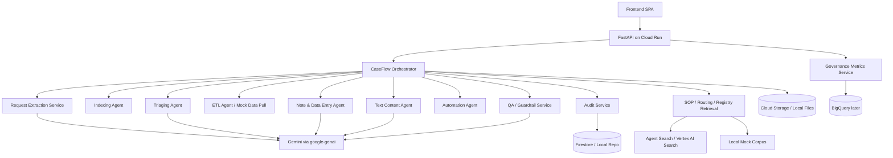

# CaseFlow Agent — Target GCP Architecture v2

## Architecture principle

Build CaseFlow as a **GCP-native sidecar workflow system** that can ingest legal request packages, run extraction/classification/drafting workflows, preserve auditability, and avoid Core Eng codebase changes.

The MVP must run locally without live GCP credentials. GCP services should be integrated behind adapter interfaces.

## Updated MVP architecture



## Service map

| Concern | MVP service / pattern | Later GCP service |
|---|---|---|
| Backend | FastAPI | Cloud Run |
| Frontend | React or Angular SPA | Cloud Run bundled or separate hosting |
| Auth | local mock user | IAP / Workspace identity |
| LLM | mock model first | Gemini via `google-genai` |
| Retrieval | local JSON/markdown | Agent Search / Vertex AI Search |
| Source docs | local file storage | Cloud Storage |
| Workflow state | local repository | Firestore |
| Audit events | local repository | Firestore + Cloud Logging |
| Governance metrics | local aggregation | Firestore + BigQuery |
| Secrets | `.env.local` ignored | Secret Manager |
| Observability | structured logs | Cloud Logging / Trace / Monitoring |
| Deployment | local dev | Cloud Run + Cloud Build |

## Local-first adapters

```text
CaseRepository:
  - LocalJsonCaseRepository
  - FirestoreCaseRepository

AuditRepository:
  - LocalJsonAuditRepository
  - FirestoreAuditRepository

StorageRepository:
  - LocalFileStorageRepository
  - CloudStorageRepository

RetrievalService:
  - LocalSopRetrievalService
  - AgentSearchRetrievalService

ModelClient:
  - MockModelClient
  - GeminiModelClient

ResponseRecordRepository:
  - LocalMockResponseRecordRepository
  - ApprovedDataSourceAdapter (future only)
```

## Model router

Do not hardcode models inside agents.

Tasks:

- `request_extraction`
- `triage_classification`
- `note_drafting`
- `response_package_drafting`
- `deficiency_response_drafting`
- `qa_validation`
- `governance_insights`

## Retrieval corpora

Local first:

```text
mock_data/sop/
mock_data/routing_rules/
mock_data/deficiency_rules/
mock_data/response_package_rules/
mock_data/product_domain_taxonomy/
mock_data/sensitive_party_registry/
```

Future Agent Search data store:

```text
gs://caseflow-grounding/
  sops/
  routing-rules/
  response-templates/
  deficiency-rules/
  product-taxonomy/
  training-examples/
```

## Required metadata for every agent run

- request ID
- legal request ID
- case/workflow state
- agent name
- model ID
- prompt version
- evidence IDs
- confidence
- input hash
- output schema version
- validation status
- latency
- retry count
- human review status
- audit event ID

## Critical architecture guardrails

- Approval policy lives in code, not only prompts.
- Audit logging is mandatory for state-changing actions.
- Production write-back adapters must not exist in MVP.
- Gemini output is advisory / draft only.
- ETL is mock-only in MVP unless separately approved.
- Agent Search is retrieval/grounding, not the workflow orchestrator.
